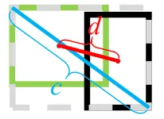

# From Monocular Camera Image to BEV - Improving Pedestrians Detection
#### Quentin Delfosse, Gloria Mellinand

This code was built upon a pre-existing [Image to BEV deep learning model](https://github.com/avishkarsaha/translating-images-into-maps/), based on the paper [Translating Images Into Maps](https://arxiv.org/abs/2110.00966). 
This code was written using python 3.7. and was trained on the nuScenes dataset.
Please refer to the repository's Read Me for dependencies and datasets to install.

## Using the code
The first step is to create a folder named "translating-images-into-maps-main" and download all files into it.
Then, due to large file size, the latest checkpoint of our training and the mini nuScenes dataset used for validation can be downloaded [from this Google Drive](https://drive.google.com/drive/folders/0ALp6UvHAP1hAUk9PVA). These folders should be added directly in the "translating-images-into-maps-main" directory. 

Below is the list of required libraries for this repo:
```pytorch
opencv
numpy
pyquaternion
shapely
lmdb
nuscenes-devkit
pillow
matplotlib
torchvision
descartes
scipy
tensorboard
scikit-image
cv2
```

## Project Context
This project was made in the context of the Deep Learning for Autonomous Vehicules course CIVIL-459, taught by Professor Alexandre Alahi at EPFL. We were supervised by doctoral student Yuejiang Liu. 
The main goal of the course's project is to develop a deep learning model that can be used onboard a Tesla autopilot system. As for our group, we have been looking into the transformation from monocular camera images to bird's eye view. This can be done by using semantic segmentation to classify elements such as cars, sidewalk, pedestrians and the horizon. 

During our research on Monocular images to BEV deep learning models, we have noticed that information concerning pedestrians was lost during segmentation, resulting in poor classification. As seen on the image below, when evaluated, the model we selected reaches a mean of 25.7% IoU (Intersection over Union) over 14 classes of objects on the nuScenes dataset. The prediction accuracy for drivables is good (74.5%), quite poor for bikes, barriers and trailers. 
However the prediction accuracy for pedestrians (9.5%) is far too low. Such a low accuracy could cause accidents if someone were to cross the road without being on the crossing. 
<div>
</img>
</div>
<br />

More information about our research can be found on the [Drive](https://drive.google.com/drive/folders/0ALp6UvHAP1hAUk9PVA).

## Contribution
As the poor detection of pedestrians seemed to be the most immediate issue with the current trained model, we aimed to improve the accuracy by looking into better suited loss functions, and training the new model on the nuScenes dataset. 

The model we built upon was trained using an IoU loss function, which is scale-invariant and used for bounding box regression. IoU measures the overlap between the ground truth's and the model's prediction bounding boxes, without taking into account the localization accuracy. Therefore a high IoU does not imply correct localization. This also induces errors for small bounding box sizes (pedestrians, bikes) as they are more difficult to localize accurately.

Another issue with IoU is its poor detection of extreme aspect ratios, which can be found in pedestrians (length of the box is generally much higher than width).
```math
L_{IoU} = 1-{{|B \cap B_{gt}|} \over {|B \cup B_{gt}|}}
```
$L_{IoU}$ is the IoU loss.
$B_{gt}$ is the ground truth bounding box while $B$ is the predicted bounding box.

The $DIoU$ (Distance IoU) loss function solves many of these issues. 
```math
D_{IoU} = 1 - IoU + {{\rho^2(b,b_{gt})} \over {c^2}}
```
<div>
</img>
</div>
<br />

$\rho^2(b,b_{gt})$, or $d$ is the l2 distance between the centers of the ground truth and predicted bounding boxes.
It uses l2 norm to minimize the distance between predicted and target boxes, and converges much faster than $IoU$, especially in non-overlapping cases. It also considers the horizontal and vertical orientations of the box, resulting in better detection of extreme aspect ratios (see image below).


## Results

## Project Evolution

## References
<a id="1">[1]</a> 
Saha, Avishkar and Mendez, Oscar and Russell, Chris and Bowden, Richard (2022). 
Translating Images into Maps.
2022 IEEE International Conference on Rbotics and Automation (ICRA)

<a id="1">[1]</a> 
Saha, Avishkar and Mendez, Oscar and Russell, Chris and Bowden, Richard (2021). 
Enabling spatio-temporal aggregation in birds-eye-view vehicle estimation.
2021 IEEE International Conference on Robotics and Automation (ICRA) (pages 5133-5139)
