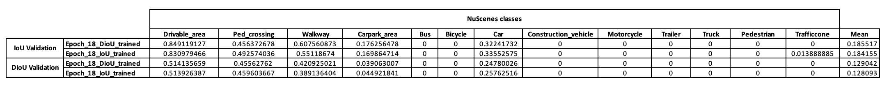
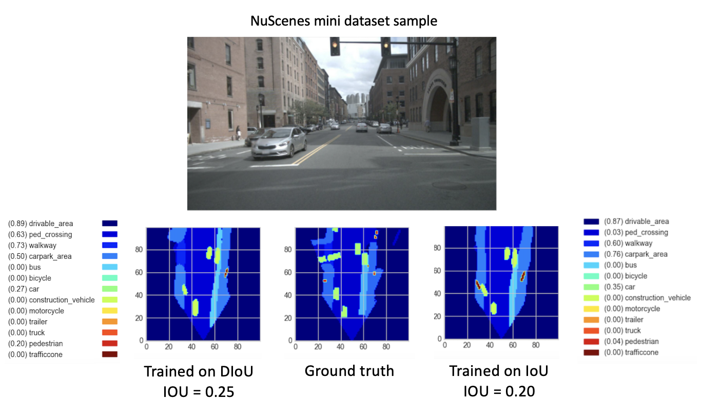
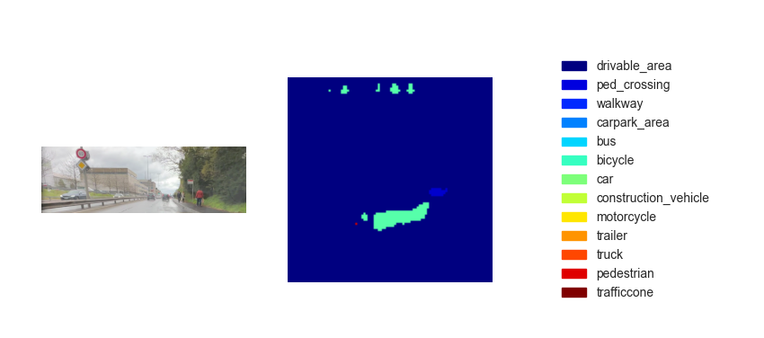

# From Monocular Camera Image to BEV - Improving Pedestrians Detection
#### Quentin Delfosse, Gloria Mellinand

This code was built upon a pre-existing [Image to BEV deep learning model](https://github.com/avishkarsaha/translating-images-into-maps/), based on the paper [Translating Images Into Maps](https://arxiv.org/abs/2110.00966). 
This code was written using python 3.7. and was trained on the nuScenes dataset.
Please refer to the [repository's ReadMe](https://github.com/avishkarsaha/translating-images-into-maps/) for dependencies and datasets to install.


## Using the code
The first step is to create a folder named "translating-images-into-maps-main" and download all files into it.
Then, due to large file size, the latest checkpoints of our training and the mini nuScenes dataset used for validation can be downloaded [from this Google Drive](https://drive.google.com/drive/folders/0ALp6UvHAP1hAUk9PVA). These folders should be added directly in the "translating-images-into-maps-main" directory. 

Below is the list of required libraries for this repo:
```pytorch
opencv
numpy
pyquaternion
shapely
lmdb
nuscenes-devkit
pillow
matplotlib
torchvision
descartes
scipy
tensorboard
scikit-image
cv2
```

### Main command line arguments

To use the functions of this repository, the following command line arguments may need to be changed:

```
--name: name of the experiment
--video-name: name of the video file within the video root and without extension
--savedir: directory to save experiments to
--val-interval: number of epochs between validation runs
--root: directory of the repository
--video-root: absolute directory to the video input
--nusc-version: nuscenes version (either “v1.0-mini” or “v1.0-trainval” for the full US dataset)
--train-split: training split (either “train_mini" or “train_roddick” for the full US dataset)
--val-split: validation split (either “val_mini" or “val_roddick” for the full US dataset)
--data-size: percentage of dataset to train on
--epochs: number of epochs to train for
--batch-size: batch size
--cuda-available: environment used (0 for cpu, 1 for cuda)
--iou: iou metric used (0 for iou, 1 for diou)
```

As for training the model, these command line arguments can be modified:
```
--optimizer: optimizer for gradient descent to run during training. Default: adam
--lr: learning rate. Default: 5e-5
--momentum: momentum for Stochastic gradient descent. Default: 0.9
--weight-decay: weight decay. Default: 1e-4
--lr-decay: learning rate decay. Default: 0.99
```

### Datasets

The NuScenes Mini and Full datasets can be found at the following locations:

NuScene Mini: 
- Google Drive: https://drive.google.com/drive/folders/1IZCGg1rXx8bkA2eUY1sjk9PAR64_vzHV?usp=share_link
-  Scitas: /work/scitas-share/datasets/Vita/civil-459/Nuscenes_bev

NuScenes Full US: 
- Scitas: /work/scitas-share/datasets/Vita/civil-459/NuScenes_full/US


As the NuScene mini and full datasets do not have the same image input format (lmdb or png), some modifications need to be applied to the code to use one or the other:

- Change the <code>mini</code> argument to false to use the mini dataset as well as the args paths and splits in the <code>train.py</code>, <code>validation.py</code> and <code>inference.py</code> files.

```python
    data = nuScenesMaps(
        root=args.root,
        split=args.val_split,
        grid_size=args.grid_size,
        grid_res=args.grid_res,
        classes=args.load_classes_nusc,
        dataset_size=args.data_size,
        desired_image_size=args.desired_image_size,
        mini=True,
        gt_out_size=(200, 200),
    )

    loader = DataLoader(
        data,
        batch_size=args.batch_size,
        shuffle=False,
        num_workers=0,
        collate_fn=src.data.collate_funcs.collate_nusc_s,
        drop_last=True,
        pin_memory=True
    )
```

- Comment/Uncomment the lines 151-153 or 146-149 of the <code>data_loader.py</code> function: 
       
```python
# if mini:
image_input_key = pickle.dumps(id,protocol=3)
with self.images_db.begin() as txn:
    value = txn.get(key=image_input_key)
    image = Image.open(io.BytesIO(value)).convert(mode='RGB')
# else:
# original_nusenes_dir = "/work/scitas-share/datasets/Vita/civil-459/NuScenes_full/US/samples/CAM_FRONT"
# new_cam_path = os.path.join(original_nusenes_dir, Path(cam_path).name)
# image = Image.open(new_cam_path).convert(mode='RGB')
```

### Checkpoints

The pretrained checkpoints can be found here:
- Scitas: /work/scitas-share/datasets/Vita/civil-459/Nuscenes_bev/pretrained_models/27_04_23_11_08 
- Google Drive: https://drive.google.com/drive/folders/1z2pZ6RM0d0gsSXmK-jGxJ9VKoXGtlB5t?usp=share_link.

The checkpoints need to be kept within <code>/pretrained_models/27_04_23_11_08</code> from the root directory of this repository. Should you want to load them from another directory, please change the following arguments:

```python
--savedir="pretrained_models" # Careful, this path is relative in validation.py but global in train.py
--name="27_04_23_11_08"
```

### Training

To train on scitas, you need to launch the following script from the root directory:

```
sbatch job.script.sh
```

To train locally on cpu:

```
python3 train.py
```

Make sure to adapt the script with your command line args.


### Validation

To validate a model performance on scitas:

```
sbatch job.validate.sh
```

To train locally on cpu:

```
python3 validate.py
```

Make sure to adapt the script with your command line args.


### Inference

To infer on a video on scitas:

```
sbatch job.evaluate.sh
```

To train locally on cpu:

```
python3 inference.py
```

Make sure to adapt the script with your command line args, especially:
```
--batch-size // 1 for the test videos
--video-name
--video-root
```

## Project Context
This project was made in the context of the Deep Learning for Autonomous Vehicles course CIVIL-459, taught by Professor Alexandre Alahi at EPFL. We were supervised by doctoral student Yuejiang Liu. 
The main goal of the course's project is to develop a deep learning model that can be used onboard a Tesla autopilot system. As for our group, we have been looking into the transformation from monocular camera images to bird's eye view. This can be done by using semantic segmentation to classify elements such as cars, sidewalk, pedestrians and the horizon. 

During our research on Monocular images to BEV deep learning models, we have noticed that information concerning pedestrians was lost during segmentation, resulting in poor classification. As seen on the image below, when evaluated, the model we selected reaches a mean of 25.7% IoU (Intersection over Union) over 14 classes of objects on the nuScenes dataset. The prediction accuracy for drivables is good (74.5%), quite poor for bikes, barriers and trailers. 
However the prediction accuracy for pedestrians (9.5%) is far too low. Such a low accuracy could cause accidents if someone were to cross the road without being on the crossing. 
<div>
</img>
</div>
<br />

More information about our research can be found on the [Drive](https://drive.google.com/drive/folders/0ALp6UvHAP1hAUk9PVA).

## Contribution
As the poor detection of pedestrians seemed to be the most immediate issue with the current trained model, we aimed to improve the accuracy by looking into better suited loss functions, and training the new model on the nuScenes dataset. 

The model we built upon was trained using an $IoU$ loss function, which is scale-invariant and used for bounding box regression. $IoU$ measures the overlap between the ground truth's and the model's prediction bounding boxes, without taking into account the localization accuracy. Therefore a high $IoU$ does not imply correct localization. This also induces errors for small bounding box sizes (pedestrians, bikes) as they are more difficult to localize accurately.

Another issue with $IoU$ is its poor detection of extreme aspect ratios, which can be found in pedestrians (length of the box is generally much higher than width).
```math
L_{IoU} = 1-{{|B \cap B_{gt}|} \over {|B \cup B_{gt}|}}
```
$L_{IoU}$ is the $IoU$ loss.
$B_{gt}$ is the ground truth bounding box while $B$ is the predicted bounding box.

The $DIoU$ (Distance IoU) loss function solves many of these issues. 
```math
D_{IoU} = 1 - IoU + {{\rho^2(b,b_{gt})} \over {c^2}}
```
<div>
<p align="center">
</img>
</p>
</div>
<br />
$b_{gt}$ is the center point of the ground truth bounding box while $b$ is the center point of the predicted bounding box. 
$\rho^2(b,b_{gt})$, or $d$ is the l2 distance between the centers of the ground truth and predicted bounding boxes.

It uses l2 norm to minimize the distance between predicted and target boxes, and converges much faster than $IoU$, especially in non-overlapping cases[[1]](#1). The penalty term linked to the distance between the bounding boxes makes the algorithm less sensitive to the box size, and increases accuracy of detection of smaller objects. 
It also considers the horizontal and vertical orientations of the box, resulting in better detection of extreme aspect ratios (see images below). In green is the predicted box, and in red the target box.

<div>
<p align="center">
</img>
</p>
</div>

<p align="center">
<em>
Horizontal Stretch
</em>
</p>
<br />

<div>
<p align="center">
</img>
</p>
</div>

<p align="center">
<em>
Vertical Stretch
</em>
</p>
<br />

Moreover, $DIoU$ loss introduces a regularization term that encourages smooth convergence.

As can be seen in the following image, the $DIoU$ loss function encourages a fast convergence of the prediction box to the ground truth box.

<div>
<p align="center">
</img>
</p>
</div>
<br />

After the research phase, we implemented the $DIoU$ loss in the <code>bbox_overlaps_diou</code> function in the <code>/src/utils.py</code> file, by using the $DIoU$ formula given above. 

This function is then used to compute multiscale $IoU$ and $DIoU$ in the <code>compute_multiscale_iou</code> function of the same file. For each class, the $DIoU$ or $IoU$ (in function of the input argument) is calculated over the batch size. The output of the function are a dictionary <code>iou_dict</code> containing the multiscale $IoU$ and class count values for each sample and scale, and per sample $IoU$.

We then used these values in <code>train.py</code>, where the $IoU$ and $DIoU$ losses were computed as an evaluation metric and used in the evaluation runs once every <code>val-interval</code> epochs. These values were also used in <code>validation.py</code> where they were used to display the losses and $IoU$s on a validation batch.

We trained the model on the NuScenes dataset starting with the provided checkpoint <code>checkpoint-008.pth.gz</code>, once with the $DIoU$ loss function, and another time with the standard $IoU$ loss. This was done using SCITAS, EPFL's computing facility. 

Another contribution is the new format of visualization to distinguish classes better with all corresponding labels and IoU values. This was implemented in the <code>visualization.py</code> file.

Lastly, we worked to implement a mode that would take <code>.mp4</code> videos as input and would decompose them into individual image frames. These would then be evaluated by the model and we could visualize the segmentation result in the <code>inference.py</code> file. 

## Results

### Training and Validation results

To have a preliminary idea of the training stratregy of this model, we first decided train it on the NuScenes mini datasets. Starting from <code>checkpoint-008.pth.gz</code>, we were able to train two models different in the IoU metric used (IoU for one and DIoU). The results obtained on a NuScenes mini batch after 10 epochs of training are presented in the table below.

<div>
<p align="center">
</img>
</p>
</div>
<br />

After looking at these results, we observed that the pedestrian class, which we based our hypothesis on, did not present conclusive results at all. We therefore concluded that the minidataset was not sufficient for our needs and decided to move our training to the full dataset on Scitas.

After training our new models (with DIoU or IoU) from <code>checkpoint-008.pth.gz</code> for 8 new epochs, we observed promising results. With the aim of comparing the performance of these newly trained models, we performed a validation step on the mini dataset. A visualization of the result for an image of this dataset is provided below.


<div>
<p align="center">
</img>
</p>
</div>
<br />

Here, the IoU metric was use to validate the models. We can note that the accurary of the model trained with the DIoU metric exceeds the one trained with the standard $IoU$. Further, the pedestrian class is better represented after using the the $DIoU$ training, which tends to support our hypothesis that $DIoU$ is better to classify smaller objects in the image. Nevertheless, a more complete dataset is required to truly validate this statement. A table was therefore computed based on a batch of the NuScenes mini dataset to compare both models over a series of images. The results are presented below.

<div>
<p align="center">
</img>
</p>
</div>
<br />

These results finally show a better performance of the $DIoU$ training over the $IoU$ one for small classes such as pedestrians, in both DIoU and IoU validation runs. The impact of the $DIoU$ training can further be observed on the $DIoU$ validation runs (last 2 lines of the table) as the difference between the performance of $DIoU$ trained network and the $IoU$ trained one is bigger than using the $IoU$ metric for validation.

### Inference results

Now that we have a trained model, we can use it to predict the BEV using any input images or videos. While our ambition was to implement our method within the course's final demo, the bird's eye view maps infered were unfortunately not sufficiently performant. The figure below shows the inference result on one of the test videos provided (see https://drive.google.com/drive/folders/16xf0AF9zgWAuK6Xyr5xK85t77hM3BwAv?usp=sharing). 

<div>
<p align="center">
</img>
</p>
</div>
<br />

This lack of performance for the inference is believed to be due to the following paramaters:

- First, the camera calibration parameters necessary to our model had to be taken from the NuScenes Mini dataset, supposing that a similar camera would be used for the images to be infered on.
- Second, the camera orientation and positioning within the car instead of in front of it was not expected. As the image had to be cropped along its width, the scaling operations performed along the width to adapt to the input format of the model may have changed the geometry of the objects to be predicted beyond the performance of the model.


## Project Evolution
Although the passage from $IoU$ to $DIoU$ loss function has proven successful in better representing pedestrians and small objects with extreme aspect ratios, the accuracy should be higher if human lives are at stake. There are multiple interesting paths that could be explored to further increase the model's prediction accuracy. 

One option is to implement $CIoU$ (Complete IoU) and train the model with this loss function. 
```math
C_{IoU} = 1- IoU + {{\rho^2(b,b_{gt})} \over {c^2}} + \alpha V \arctan(\frac{w_{gt}}{h_{gt}})
```
```math
V = \frac{4}{\pi^2}(\arctan(\frac{w_{gt}}{h_{gt}}) - \arctan(\frac{w}{h}))^2
```
```math
\alpha = 0 \text{ if IoU } < 0.5 
```
```math
\alpha = {V \over V+(1-IoU)} \text{ if IoU } \ge 0.5
```
$w_{gt}$ and $w$ are the widths of the ground truth and prediction bounding boxes.
$h_{gt}$ and $h$ are the heights of the ground truth and prediction bounding boxes.

The CIoU is based on the DIoU and takes 3 geometric factors into account: Overlapping area (present in IoU and DIoU), distance (present in DIoU) and aspect ratio. Compared to DIoU, the additional penalty term for aspect ratio similarity between ground truth and predicted bounding boxes encourages similar proportions, thus helping in the accurate detection of small objects and extreme aspect ratios.

Furthermore, according to research done by this paper [[2]](#2), regression error for CIoU degrades faster than the rest, and will converge to DIoU loss. 

<div>
<p align="center">
</img>
</p>
</div>
<br />

Another option is to train on datasets that are rich in crowdy environments to have a better representation of pedestrians and bicycles. 

Finally, to truly validate our hypothesis, a validation run on the full NuScenes dataset could be conducted and the pedestrian IoUs of the two models could be compared.

## References
<a id="1">[1]</a> 
Zhaohui Zheng, Ping Wang, Wei Liu, Jinze Li, Rongguang Ye, Dongwei Ren (2020). 
Distance-IoU Loss: Faster and Better Learning for Bounding Box Regression
https://arxiv.org/pdf/1911.08287.pdf

<a id="2">[2]</a> 
Zhaohui Zheng, Ping Wang, Dongwei Ren, Wei Liu, Rongguang Ye, Qinghua Hu, Wangmeng Zuo (2021). 
Enhancing Geometric Factors in Model Learning and Inference for Object Detection and Instance Segmentation
https://arxiv.org/pdf/2005.03572.pdf
